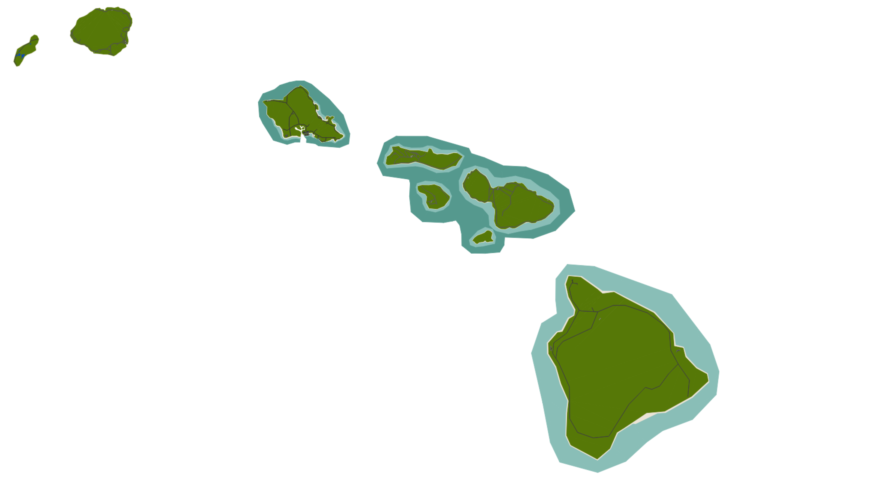
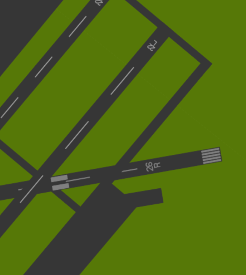
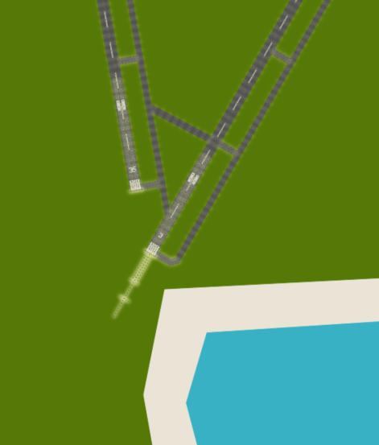

# Field Parser
This python script takes a YS Flight scenery file (.fld), and creates a GeoJSON of the features on that scenery. 
The GeoJSON (Either points, lines or polygons, depending on choice), can be loaded into a web map, a GIS software, or your own program, allowing you to view .FLD files.
## Usage

    import FieldParser as fp
    map = fp.FieldParser('path to your map/your map.fld')
    polygons = map.getGeoJSON("Polygon")
    lines = map.getGeoJSON("Line")
    points = map.getGeoJSON("Point")
   
   How you use those geojson files after this is up to you!
   The format of the geojson is this:

       {"features": [{"geometry": {"coordinates": [[[-16047.7, 2706.82], [-17292.03, -9331.69], [-26816.6, -8480.56]]], "type": "Polygon"}, "properties": {"colour": ["85", "153", "142"], "type": "POLY"}, "type": "Feature"}], "type": "FeatureCollection"}

`type` is the type of geometry, so polygon, quadstrip, quadrangle, triangle, etc.
`colour` is the rgb colour as a list.

Note to self - export this as an int...
## Examples
I have included the geojson files for hawaii's polygons and points (There aren't any lines in that one)

This has been loaded into QGIS, under a meter projection (27700)

Details of the runway, zoomed in

Lights, styled from the point geojson

## Requirements
The following python libraries are required:

    numpy
    geojson
## Thanks

 - Big thanks to Decaff42 for words of encouragement on Discord, 
 - Soji for making YSFLIGHT... Wouldn't have spent years of my youth learning 3D modelling and coding if it wasn't for YS. 
 - Everyone from YSFlight.tk, YSPilots.com, and our current home
   https://www.ysfhq.com/
